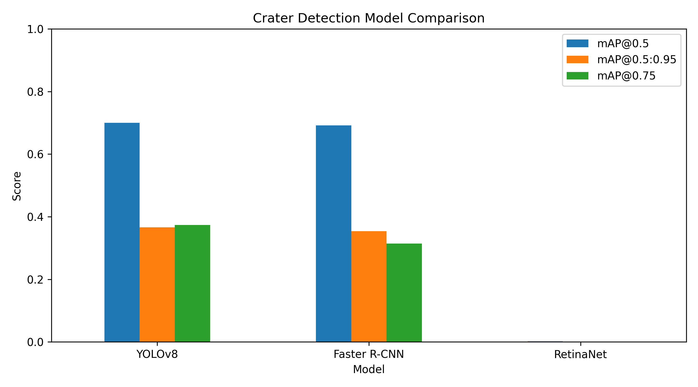

# 🚀 Crater Detection using Deep Learning

## 📌 Overview
This project implements an end-to-end crater detection pipeline using deep learning object detection models.  
The goal is to detect craters in planetary surface images using bounding-box ground truth annotations.

### Models Used
- YOLOv8 (one-stage detector)
- Faster R-CNN (two-stage detector)
- RetinaNet (one-stage detector with focal loss)

---

## 📂 Repository Structure

```
1-Project-Code/
├── martianlunar-crater-detection-dataset/
│   └── craters/
│       ├── data.yaml
│       ├── train/
│       ├── valid/
│       └── test/
│
├── ground_truth_examples/
├── runs/detect/
├── train.py
├── test.py
├── predict.py
├── show_ground_truth.py
├── dataset_summary.py
├── train_torchvision_detectors.py
├── compare_detectors.py
├── faster_rcnn_crater.pth
├── retinanet_crater.pth
├── yolov8n.pt
├── model_comparison_results.csv
└── model_comparison_plot.png
```

---

## 📊 Dataset

Each image has a corresponding `.txt` file using YOLO format:

```
class x_center y_center width height
```

Some label files are empty, meaning no craters are present.  
This improves model robustness by teaching background-only cases.

### Dataset Summary

| Split | Images | Craters |
|------|--------|--------|
| Train | 98 | 681 |
| Valid | 26 | 202 |
| Test | 19 | 151 |

---

## 🧠 Pipeline

```
Images → Ground Truth → Training → Evaluation → Predictions → Comparison
```

---

## ⚙️ Code Overview

### dataset_summary.py
Summarizes dataset statistics.

### show_ground_truth.py
Visualizes bounding boxes.

### train.py
Trains YOLOv8 model.

### test.py
Evaluates YOLOv8 model.

### predict.py
Generates predictions.

### train_torchvision_detectors.py
Trains:
- Faster R-CNN
- RetinaNet

### compare_detectors.py
Evaluates all models and generates:
- CSV results
- comparison plot

---

## 📈 Results

| Model | mAP@0.5 | mAP@0.5:0.95 |
|------|--------|--------------|
| YOLOv8 | ~0.70 | ~0.37 |
| Faster R-CNN | ~0.69 | ~0.35 |
| RetinaNet | ~0.00 | ~0.00 |

---

## 📊 Model Comparison Plot



---

## 🔍 Key Insights

- YOLOv8 performed best overall
- Faster R-CNN was competitive
- RetinaNet underperformed due to limited training

---

## ▶️ How to Run

Install dependencies:

```
pip install ultralytics torch torchvision torchmetrics pycocotools pandas matplotlib opencv-python pillow tqdm
```

Run pipeline:

```
python dataset_summary.py
python show_ground_truth.py
python train.py
python test.py
python predict.py
python train_torchvision_detectors.py
python compare_detectors.py
```

---

## ⚠️ Limitations

- Small dataset
- CPU training constraints
- RetinaNet undertrained

---

## 🔮 Future Work

- Train on GPU
- Use larger datasets
- Try foundation models (SAM, Grounding DINO)

---

## 📌 Summary

This project demonstrates a full crater detection pipeline using modern deep learning techniques and compares multiple object detection models.
